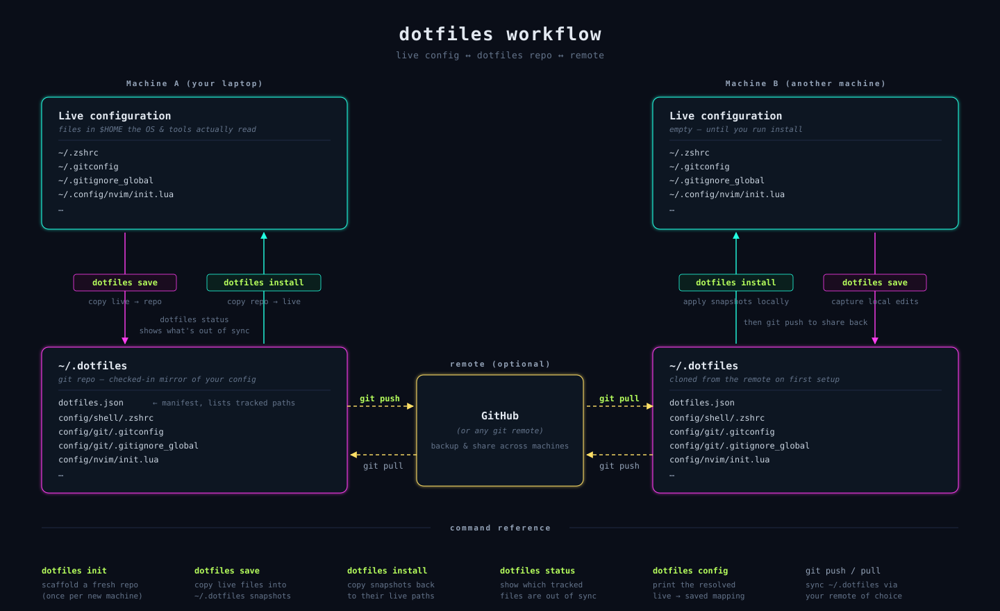

# dotfiles CLI

An agent-friendly self-describing CLI to manage your [dotfiles](https://dotfiles.github.io/).



## Install

Prerequisites: Go (1.25+) and `git`.

```sh
go install github.com/dreikanter/dotfiles-cli/cmd/dotfiles@latest
```

This installs the `dotfiles` binary into `$GOBIN` (default `~/go/bin`); make
sure that directory is on your `PATH`.

## Setup

Run `dotfiles init` to scaffold a new dotfiles repository (default
`~/.dotfiles`):

```sh
dotfiles init
```

It creates the directory, writes an empty `dotfiles.json` manifest and a
starter `README.md`, then runs `git init`.

The repository is a checked-in mirror of the live config files on your
machine. The manifest (`dotfiles.json`) maps tool names to lists of paths and
tells the CLI which files to track:

```json
{
  "git":   ["~/.gitconfig", "~/.gitignore_global"],
  "shell": ["~/.zshrc"],
  "nvim":  ["~/.config/nvim/"]
}
```

A trailing `/` marks an entry as a directory (its contents are tracked
recursively). Files mirror to `<repo>/config/<tool>/<rel>`.

### Why copy, not symlink?

It copies files rather than symlinking them. Symlinks break when some apps save their config atomically (write-temp-then-rename), which silently replaces the link with a regular file, so the dotfiles repo stops tracking changes. Copying keeps the repo a plain, reliable mirror.

## Commands

- `dotfiles init` — scaffold a fresh dotfiles repository
- `dotfiles save` — copy tracked files into the dotfiles repository
- `dotfiles install` — copy tracked files to their live paths
- `dotfiles status` — show the tracked files status
- `dotfiles config` — print the resolved live-to-saved mapping
- `dotfiles skill` — print or install an agent skill describing this CLI

### Flags

These flags are accepted by every command:

- `--json` — emit a single JSON object on stdout instead of plain text (see [JSON output](#json-output))
- `--root <path>` — repository root (default `$DOTFILES_ROOT` or `~/.dotfiles`)
- `--config <path>` — manifest path (default `$DOTFILES_CONFIG` or `<root>/dotfiles.json`)

Command-specific flags (`-n, --dry-run`, `-v, --verbose`, `-p, --prune`,
`--tool`, `--file`, `--force`) are shown in the Usage examples below; run
`dotfiles <command> --help` for the full list.

## Usage

```sh
# Scaffold a fresh dotfiles repository
dotfiles init

# Inspect what init generated
tree ~/.dotfiles
# ~/.dotfiles
# ├── README.md
# └── dotfiles.json

# Re-scaffold an existing repository, overwriting dotfiles.json and README.md
dotfiles init --force

# Install tracked files to their live paths
dotfiles install

# Save a single tool's files
dotfiles save --tool git

# Save specific files within a tool
dotfiles save --tool git --file ~/.gitconfig --file ~/.gitignore_global

# Save and remove destination files no longer in the manifest
dotfiles save --prune

# Report which managed files are out of sync
dotfiles status

# Print the resolved live-to-saved mapping
dotfiles config
# Root: /home/user/.dotfiles
# Config: /home/user/.dotfiles/dotfiles.json
#
# git    /home/user/.gitconfig
# git    /home/user/.gitignore_global
# nvim   /home/user/.config/nvim/init.lua
# nvim   /home/user/.config/nvim/lua/plugins.lua
# shell  /home/user/.zshrc
# 5 entries

# Scope status and config to a single tool or files
dotfiles status --tool git --file ~/.gitconfig
dotfiles config --tool git

# Run against a custom repository (handy for demos and testing)
dotfiles --root ./testdata/sample-repo status
# 5 files in sync

# Print the agent skill (markdown + YAML frontmatter) to stdout
dotfiles skill

# Install the skill into Claude Code's skills directory
dotfiles skill --install --agent=claude

# Auto-detect installed AI assistants and install into each
dotfiles skill --install
```

## JSON output

Pass `--json` to any command to receive a single JSON object on stdout. JSON
output is never mixed with plain text, and `--verbose` is ignored when `--json`
is set.

Per-command JSON shapes are documented in `dotfiles <command> --help` — that
is the single source of truth. Use `jq` to extract specific fields:

```sh
dotfiles status --json | jq '.summary.unsynced'
dotfiles save --json   | jq '.actions[] | select(.action=="error")'
```

The exit code is still non-zero on failure; failures emit an error envelope:

```json
{ "error": { "message": "load manifest: ..." } }
```

## Development

```sh
make test    # run tests with coverage
make lint    # run golangci-lint
```

See `CLAUDE.md` for project conventions and the release workflow.
